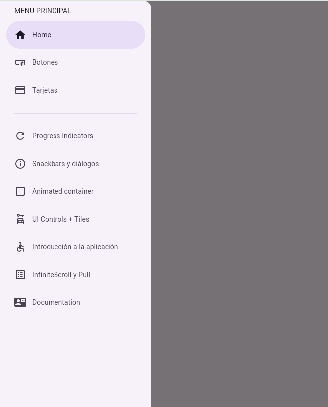

# GoRouterApp

Aplicacion en flutter para la gestion de un menu dinamico, partiendo de una LISTA con las opciones del menu con los atributos de title, subtitle, icon, link, haciendo uso de la libreria GoRouter.

## Instalacion de libreria GoRouter

[Instalacion] (https://pub.dev/packages/go_router/install)

```shell
flutter pub add go_router
```

## DEMO

Aqui encontraras un ejemplo de la aplicacion en ejecucion desde el navegador Google Chrome.

[](#)

##### El contenido de este repositorio esta basado en el curso: [DevTalles](https://cursos.devtalles.com/pages/programas-flutter)