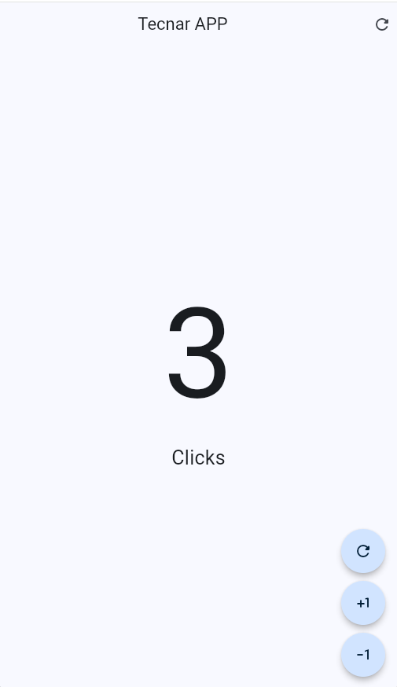

# hello_world_app_2

Aplicacion en flutter para el manejo de un contador realizando acciones de incrementar, decrementar y resetear el contador.

## DEMO

Aqui encontraras un ejemplo de la aplicacion en ejecucion desde el navegador Google Chrome.

##### El contenido de este repositorio esta basado en el curso: [DevTalles](https://cursos.devtalles.com/pages/programas-flutter)